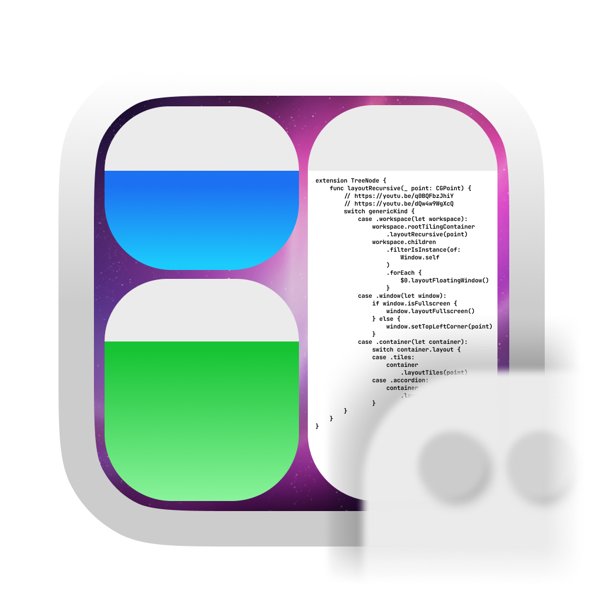

# AeroSpace Beta [](https://github.com/nikitabobko/AeroSpace/actions/workflows/build.yml)

AeroSpace is an i3-like tiling window manager for macOS

- [YouTube Demo](https://www.youtube.com/watch?v=UOl7ErqWbrk)
- [AeroSpace Guide](https://nikitabobko.github.io/AeroSpace/guide.html)
- [AeroSpace Commands](https://nikitabobko.github.io/AeroSpace/commands.html)
- [AeroSpace Config Examples](https://nikitabobko.github.io/AeroSpace/config-examples.html)
- [AeroSpace Goodness](https://nikitabobko.github.io/AeroSpace/goodness.html)

## Project status

Public Beta. Feedback is very much welcome

- I encourage you to try AeroSpace and file GitHub issues if something doesn't work for you
- I already use AeroSpace on daily basis and I'm happy with it
- [The documentation](https://nikitabobko.github.io/AeroSpace/guide.html) covers all major things you need to know

## Key features

- **Manual** tiling window manager based on a [tree paradigm](https://nikitabobko.github.io/AeroSpace/guide.html#tree)
- [i3](https://i3wm.org/) inspired
- AeroSpace employs
  its [own emulation of virtual workspaces](https://nikitabobko.github.io/AeroSpace/guide.html#emulation-of-virtual-workspaces)
  instead of relying on native macOS Spaces due
  to [their considerable limitations](https://nikitabobko.github.io/AeroSpace/guide.html#emulation-of-virtual-workspaces)
- Plain text configuration (dotfiles friendly). See: [default-config.toml](https://nikitabobko.github.io/AeroSpace/config-examples.html#default-config)
- CLI scriptable
- Doesn't require disabling SIP (System Integrity Protection)
- [Proper multi-monitor support](https://nikitabobko.github.io/AeroSpace/guide.html#multiple-monitors) (i3-like paradigm)
- Status menu icon displays current workspace name

## Installation

Install via [Homebrew](https://brew.sh/) to get autoupdates (Preferred)

```
brew install --cask nikitabobko/tap/aerospace
```

> [!NOTE]
> By using AeroSpace, you acknowledge that it's not notarized.
>
> Notarization is a "security" feature by Apple. You send binaries to Apple and they either approve the binaries or not.
> In reality, notarization is about building binaries the way Apple likes it.
> Notarization costs developers time and requires paying $99 per year.
> I don't have time to fight Apple.
>
> [Homebrew installation script](https://github.com/nikitabobko/homebrew-tap/blob/main/Casks/aerospace.rb) is configured to
> automatically delete quarantine attribute, that's why the app should work out of the box, without any warnings about AeroSpace
> "being untrusted software"

[Manual installation](./docs/manual-installation.md)

## Development notes

A notes on how to setup the project, build it, how to run the tests, etc. can be found here: [docs/development.md](docs/development.md)

## Values of the project

**Values**
- AeroSpace is targeted at advanced users and developers
- Keyboard centric
- Breaking changes (configuration files, CLI, behavior) are avoided as much as possible, but it must not let the software
  stagnate. Thus breaking changes can happen, but with careful considerations and helpful message. [Semver](https://semver.org/)
  major version is bumped in case of a breaking change (It's all guaranteed once AeroSpace reaches 1.0 version, until then
  breaking changes just happen)
- AeroSpace doesn't use GUI, unless necessarily
  - AeroSpace will never provide a GUI for configuration. For advanced users, it's easier to edit a configuration file in text
    editor rather than navigating through checkboxes in GUI.
  - Status menu icon is ok, because visual feedback is needed
- Provide _practical_ features. Fancy appearance features are not _practical_ (e.g. window borders, transparency, etc)
- If "dark magic" (aka "private APIs", "code injections", etc) can be avoided, it must be avoided
  - Right now, AeroSpace uses only a [single private API to get window ID of accessibility object](./src/Bridged-Header.h).
    Everything else is [macOS public accessibility
    API](https://developer.apple.com/documentation/applicationservices/axuielement_h).
  - AeroSpace will never require you to disable SIP (System Integrity Protection). For example, yabai [requires you to disable
    SIP](https://github.com/koekeishiya/yabai/issues/1863) to use some of its features. AeroSpace will either find another way
    ( e.g. [emulation of workspaces](https://nikitabobko.github.io/AeroSpace/guide.html#emulation-of-virtual-workspaces))
    or will not implement this feature at all (window transparency and window shadowing are not _practical_ features)

**Non Values**
- Play nicely with existing macOS features. If limitations are imposed then AeroSpace won't play nicely with existing macOS
  features
  - E.g. AeroSpace doesn't acknowledge the existence of macOS Spaces, and it uses [emulation of its own
    workspaces](https://nikitabobko.github.io/AeroSpace/guide.html#emulation-of-virtual-workspaces)

## Tip of the day

```bash
defaults write -g NSWindowShouldDragOnGesture YES
```

Now, you can move windows by holding `ctrl`+`cmd` and dragging any part of the window (not necessarily the window title)

Source: [reddit](https://www.reddit.com/r/MacOS/comments/k6hiwk/keyboard_modifier_to_simplify_click_drag_of/)

## Related projects
- [Amethyst](https://github.com/ianyh/Amethyst)
- [yabai](https://github.com/koekeishiya/yabai)
