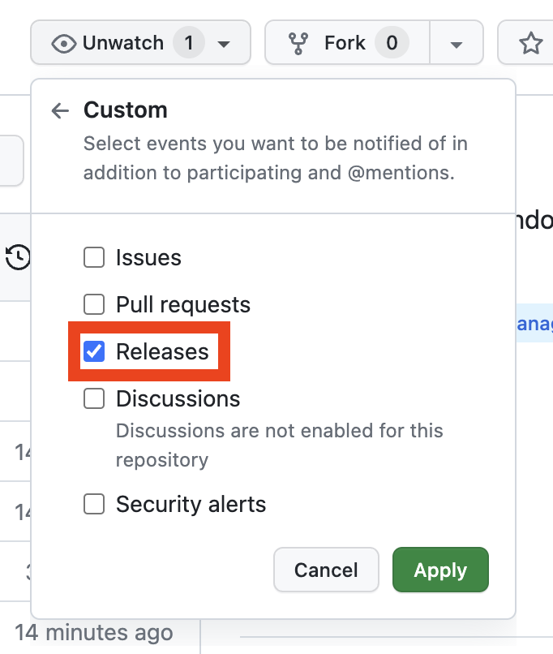

# AeroSpace [](https://github.com/nikitabobko/AeroSpace/actions/workflows/build.yml)

AeroSpace is a tiling window manager for macOS.

## Status

🚧 **Work in progress.** Not usable yet 🚧

I will publish first release once I believe it's usable, so subscribe to releases on GitHub:



## Key features

- **Manual** tiling window manager
- [i3](https://i3wm.org/) inspired
- AeroSpace employs its **own emulation of virtual workspaces** instead of relying on native macOS Spaces due to
  their considerable limitations
- Plain text configuration (dotfiles friendly)
- **[PLANNED]** CLI scriptable
- Doesn't require disabling SIP (System Integrity Protection)
- Proper multi-monitor support (i3-like paradigm)
- Status menu icon displays current workspace name

## How to build the project

You would need a Mac.

Firstly, install [xcodegen](https://github.com/yonaskolb/XcodeGen). Then run in terminal:
```bash
./build-debug.sh
```

## How to run the tests

```bash
./run-tests.sh
```

## Todo

- is dialog, is resizable, is modal?
- select parent and kill several windows at once
- select parent -> outline several windows?
  - OR: outline with "SLSSetWindowOpacity"
  - OR: "shake" windows
- CLI interface
- Check all todos in code
- move vs swap
- what is src/Assets.xcassets ?
- license
- unminimize apps automatically
- minimized apps handling
- macOS fullscreen apps handling
- unhide apps automatically

## Challenges

- Window overlapping
- "floating" window layout
- windows' min/max sizes

## Known Special windows to check

- XCode welcome screen
- Finder preview
- Toolbox window
- IntelliJ dialog windows (e.g. "Add to git")
- IntelliJ project structure modal window
- VLC full screen window (eh, I wish every fullscreen window in macOS worked like that)
- iTerm drop down window
- Chrome cmd+f window

## Limitations of macOS API

- It's not possible to find to what monitor window is assigned
- It's not possible to __reliably__ know what monitor is currently active