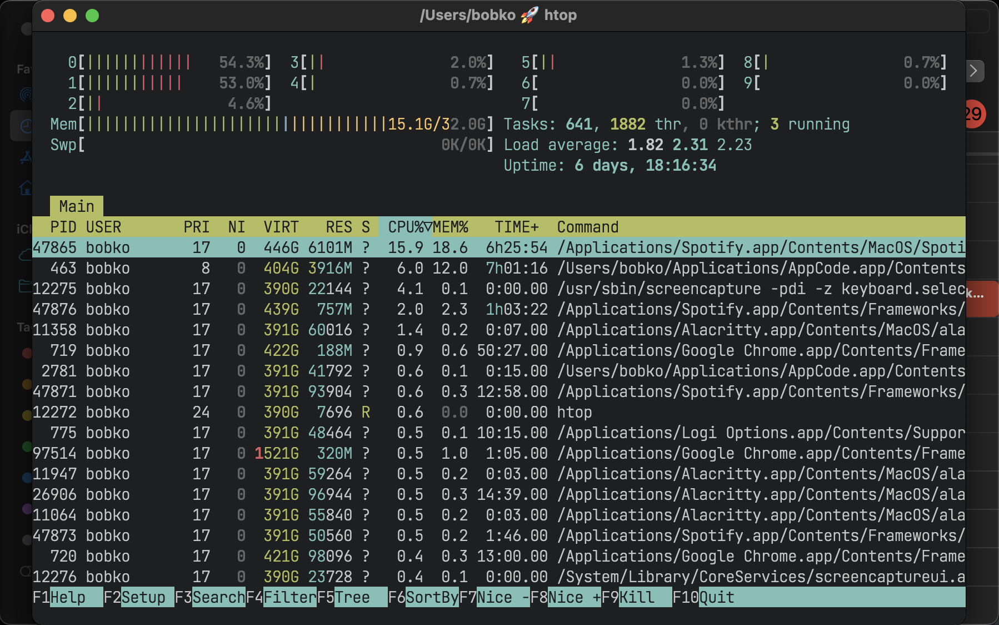
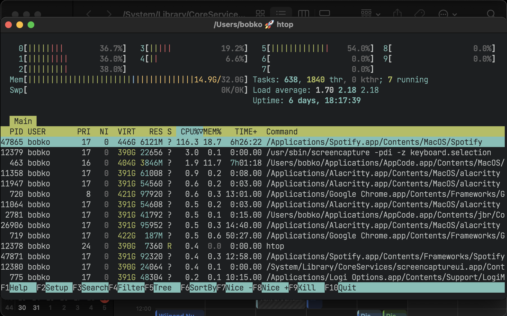

= AeroSpace Guide
include::util/site-attributes.adoc[]
:url-search-for-config: https://github.com/search?q=path%3A*aerospace.toml&type=code

include::util/header.adoc[]

[#installation]
== Installation

[#homebrew-installation]
=== Homebrew installation (Preferred)

https://brew.sh/[Homebrew] is a package manager for macOS

[source,bash]
----
brew install --cask nikitabobko/tap/aerospace
----

*(Optional)* You might need to configure your shell to enable completion provided by homebrew packages: https://docs.brew.sh/Shell-Completion
AeroSpace provides bash, fish and zsh completions.

You can also install specific previous versions:
[source,bash]
----
brew install --cask nikitabobko/tap/aerospace@0.12.0
----

For the list of all the versions available for installation via brew see: https://github.com/nikitabobko/homebrew-tap/tree/main/Casks

[#manual-installation]
=== Manual installation

. Download the latest available zip from https://github.com/nikitabobko/AeroSpace/releases[releases page]
. Unpack zip
. Put unpacked `AeroSpace-v$VERSION/AeroSpace.app` to `/Applications`
. Put unpacked `AeroSpace-v$VERSION/bin/aerospace` anywhere to `$PATH`
(The step is optional. It is only needed if you want to be able to interact with AeroSpace from CLI)

If you see this message

----
"AeroSpace.app" can't be opened because Apple cannot check it for malicious software.
----

**Option 1** to resolve the problem

```
xattr -d com.apple.quarantine /Applications/AeroSpace.app
```

**Option 2** to resolve the problem

. navigate in Finder to `/Applications/AeroSpace.app`
. Right mouse click
. Open (yes, it's that stupid)

[#configuring-aerospace]
== Configuring AeroSpace

=== Config location

AeroSpace tries to find the config in two locations:

. `~/.aerospace.toml`
. `+${XDG_CONFIG_HOME}/aerospace/aerospace.toml+`
(environment variable `XDG_CONFIG_HOME` fallbacks to `~/.config` if the variable is not presented)

If the config is found in more than one location then the ambiguity is reported.

=== Config samples

Please see the following config samples:

* <<default-config,The default config>>
* xref:goodness.adoc#i3-like-config[i3 like config]
* {url-search-for-config}[Search for configs by other users on GitHub] for inspiration

AeroSpace uses TOML format for the config.
TOML is easy to read, and it supports comments.
See https://toml.io/en/v1.0.0[TOML spec for more info]

[#default-config]
=== Default config

The default config is part of the documentation, since it contains all trivial configuration keys with comments.
Please read the default config!
Non-trivial configuration options are mentioned further in this guide.

AeroSpace fallbacks to the default config if custom config is not presented.
The default config *is not* merged into your custom config.
That's why you can drop key bindings by dropping their declaration from your custom config.

You can bootstrap your local config by coping the default config from the app installation

[source,shell]
----
cp /Applications/AeroSpace.app/Contents/Resources/default-config.toml ~/.aerospace.toml
----

link:config-examples/default-config.toml[Download]

[source,toml,subs="macros+,specialchars+"]
----
include::config-examples/default-config.toml[]
----

[#binding-modes]
=== Binding modes

You can create multiple sets of bindings by creating different binding modes.
When you switch to a different binding mode, all the bindings from the current mode are deactivated, and only the bindings specified in the new mode become active.
The initial binding mode that AeroSpace starts out with is "main".

This feature is absolutely identical to the one
https://i3wm.org/docs/userguide.html#binding_modes[in i3]

Working with binding modes consists of two parts:
1. defining a binding to switch to the binding mode and 2. declaring the binding mode itself.

[source,toml]
----
[mode.main.binding]        # Declare 'main' binding mode
alt-r = 'mode resize'      # 1. Define a binding to switch to 'resize' mode

[mode.resize.binding]      # 2. Declare 'resize' binding mode
minus = 'resize smart -50'
equal = 'resize smart +50'
----

[#commands]
=== Commands

Commands is the thing that you use to manipulate AeroSpace and query its state.

There are two ways on how you can use commands:

. Bind keys to run AeroSpace commands. Example:
+
[source,toml]
----
[mode.main.binding]
# Bind alt-1 key to switch to workspace 1
alt-1 = 'workspace 1'
# Or bind a sequence of commands
alt-shift-1 = ['move-node-to-workspace 1', 'workspace 1']
----
. Run commands in CLI. Open up a Terminal.app and type:
+
[source,bash]
----
aerospace workspace 1
----

For the list of available commands see: xref:commands.adoc[]

[#key-mapping]
=== Keyboard layouts and key mapping

By default, key bindings in the config are perceived as `qwerty` layout.

If you use different layout, different alphabet, or you just want to have a fancy alias for the existing key, you can use `key-mapping.key-notation-to-key-code`.

[source,toml]
----
# Define my fancy unicorn key notation
[key-mapping.key-notation-to-key-code]
unicorn = 'u'

[mode.main.binding]
alt-unicorn = 'workspace unicorn' # (⁀ᗢ⁀)
----

* For `dvorak` users, AeroSpace offers a preconfigured preset.
+
[source,toml]
----
key-mapping.preset = 'dvorak'
----

* For `colemak` users, there is xref:goodness.adoc#colemak-keys-remap[a compiled mapping].
`colemak` may be added as preconfigured preset similar to `dvorak` in the future, if there is enough demand

[#exec-env-vars]
=== exec-* Environment Variables

You can configure environment variables of `exec-*` commands and callbacks (such as xref:commands.adoc#exec-and-forget[exec-and-forget], <<exec-on-workspace-change-callback>>)

* `exec.inherit-env-vars = true` configures whether inherit environment variables of `AeroSpace.app` or not. (The default is `true`)
* You can override env variables with the following syntax:
+
[source,toml]
----
[exec.env-vars]
PATH = '${HOME}/bin:${PATH}'
----
+
Environment variable substitution is supported in form of `+${ENV_VAR}+`
* You can inspect what is the end result of environment variables using xref:commands.adoc#list-exec-env-vars[`list-exec-env-vars` command]
* GUI apps on macOS don’t have Homebrew’s prefix in their `PATH` by default (https://docs.brew.sh/FAQ#my-mac-apps-dont-find-homebrew-utilities[docs.brew.sh]).
That's why unless you override `exec` section in your config, AeroSpace fallbacks to the following `exec` configuration:
+
[source,toml]
----
[exec]
inherit-env-vars = true
[exec.env-vars]
PATH = '/opt/homebrew/bin:/opt/homebrew/sbin:${PATH}'
----

[#tree]
== Tree

AeroSpace stores all windows and containers in a tree.
AeroSpace tree tiling model is https://i3wm.org/docs/userguide.html#tree[inspired by i3].

*Definition.* Each non-leaf node is called a "Container"

WARNING: i3 has a different terminology.
"container" in i3 is the same as "node" in AeroSpace.

* Each workspace contains its own single root node
* Each container can contain arbitrary number of children nodes
* Windows are the only possible leaf nodes. Windows contain zero children nodes
* Every container has two properties:
. <<layouts,Layout>> (Possible values: `tiles`, `accordion`)
. Orientation (Possible values: `horizontal`, `vertical`)

When we say "layout of the window", we refer to the layout of the window’s parent container.

It’s easier to understand tree tiling model by looking at examples

.Simple tree structure. Two windows side-by-side
image::assets/h_tiles.png[]

.Complex tree structure
image::assets/tree.png[]

You can nest containers as deeply as you want to.

You can navigate in the tree in 4 possible cardinal directions (left, down, up, right).
You use xref:commands.adoc#focus[focus command] to do that.

The tree structure can be changed with three commands:

. xref:commands.adoc#move[move]
. xref:commands.adoc#join-with[join-with]
. xref:commands.adoc#split[split]

[#layouts]
=== Layouts

In total, AeroSpace provides 4 possible layouts:

- `h_tiles` horizontal tiles (in i3, it’s called "horizontal split")
- `v_tiles` vertical tiles (in i3, it’s called "vertical split")
- `h_accordion` horizontal accordion (analog of i3’s "tabbed layout")
- `v_accordion` vertical accordion (analog of i3’s "stacked layout")

<<tree,From the previous section>>, you’re already familiar with the `tiles` layout.

Accordion is a layout where windows are placed on top of each other.

* *The horizontal accordion* shows left and right paddings to visually indicate the presence of other windows in those directions.
* *The vertical accordion* shows top and bottom paddings to visually indicate the presence of other windows in those directions.

.Horizontal accordion


.Vertical accordion


Just like in a `tiles` layout, you can use the xref:commands.adoc#focus[focus] command to navigate an accordion layout.

You can navigate the windows in an `h_accordion` by using the `focus (left|right)` command.
While in a `v_accordion`, you can navigate the windows using the `focus (up|down)` command.

Accordion padding is configurable via `accordion-padding` option.

[#normalization]
=== Normalization

By default, AeroSpace does two types of tree normalizations:

. Containers that have only one child are "flattened".
The root container is an exception, it is allowed to have a single window child.
Configured by `enable-normalization-flatten-containers`
. Containers that nest into each other must have opposite orientations.
Configured by `enable-normalization-opposite-orientation-for-nested-containers`

[.lead]
*Example 1*

According to the first normalization, such layout isn’t possible:

----
h_tiles (root node)
└── v_tiles
    └── window 1
----

it will be immediately transformed into

----
v_tiles (new root node)
└── window 1
----

[.lead]
*Example 2*

According to the second normalization, such layout isn’t possible:

----
h_tiles
├── window 1
└── h_tiles
    ├── window 2
    └── window 3
----

it will be immediately transformed into

----
h_tiles
├── window 1
└── v_tiles
    ├── window 2
    └── window 3
----

Normalizations make it easier to understand the tree structure by looking at how windows are placed on the screen.

You can disable normalizations by placing these lines to your config:

[source,toml]
----
enable-normalization-flatten-containers = false
enable-normalization-opposite-orientation-for-nested-containers = false
----

[#floating-windows]
=== Floating windows

Normally, floating windows are not considered to be part of the <<tree,tiling tree>>.
But it’s not the case with xref:commands.adoc#focus[focus] command.

From xref:commands.adoc#focus[focus] command perspective, floating windows are part of <<tree,tiling tree>>.
The floating window parent container is determined as the smallest tiling container that contains the center of the floating window.

This technique eliminates the need for an additional binding for focusing floating windows.

[#emulation-of-virtual-workspaces]
== Emulation of virtual workspaces

Native macOS Spaces have a lot of problems

* The animation for Spaces switching is slow
** You can’t disable animation for Spaces switching (you can only make it slightly faster by turning on `Reduce motion` setting, but it’s suboptimal)
* You have a limit of Spaces (up to 16 Spaces with one monitor)
* You can’t create/delete/reorder Space and move windows between Spaces with hotkeys (you can only switch between Spaces with hotkeys)
* Apple doesn't provide public API to communicate with Spaces (create/delete/reorder/switch Space and move windows between Spaces)

Since Spaces are so hard to deal with, AeroSpace reimplements Spaces and calls them "Workspaces".
The idea is that if the workspace isn’t active then all of its windows are placed outside the visible area of the screen, in the bottom right or left corner.
Once you switch back to the workspace, (e.g. by the means of xref:commands.adoc#workspace[workspace] command, or `cmd + tab`) windows are placed back to the visible area of the screen.

When you quit the AeroSpace or when the AeroSpace detects that it's about to crash, AeroSpace will place all windows back to the visible area of the screen.

AeroSpace shows the name of currently active workspace in its tray icon (top right corner), to give users a visual feedback on what workspace is currently active.

The intended workflow of using AeroSpace workspaces is to only have one macOS Space (or as many monitors you have, if `Displays have separate Spaces` is enabled) and don’t interact with macOS Spaces anymore.

[NOTE]
====
For better or worse, macOS doesn’t allow to place windows outside the visible area entirely.
You will still be able to see a 1 pixel vertical line of "hidden" windows in the bottom right or left corner of your screen.
That means, that if AeroSpace crashes badly you will still be able to manually "unhide" the windows by dragging these few pixels to the center of the screen.

If you want to minimize the visibility of hidden windows, it's recommended to place Dock in the bottom (and additionaly turn automatic hiding)
====

=== Proper monitor arrangement

Since AeroSpace needs a free space to hide windows in,
please make sure to arrange monitors in a way where *every monitor has free space in the bottom right or left corner.* (`System Settings -> Displays -> Arrange...`)

If you fail to arrange your monitors properly, you will see parts of hidden windows on other monitors.

.Bad monitor arrangement. Monitor 2 doesn't have free space in either of the bottom corners
image::./assets/monitor-arrangement-1-bad.svg[,,align="center"]

.Good monitor arrangement. Every monitor has free space in either of the bottom corners
image::./assets/monitor-arrangement-1-good.svg[,,align="center"]

.Bad monitor arrangement. Monitor 1 doesn't have free space in either of the bottom corners
image::./assets/monitor-arrangement-2-bad.svg[,,align="center"]

.Good monitor arrangement. Every monitor has free space in either of the bottom corners
image::./assets/monitor-arrangement-2-good.svg[,,align="center"]

[#a-note-on-mission-control]
=== A note on mission control

For some reason, mission control doesn't like that AeroSpace puts a lot of windows in the bottom right corner of the screen.
Mission control shows windows too small even there is enough space to show them bigger.

There is a workaround. You can enable `Group windows by application` setting:
[source,bash]
----
defaults write com.apple.dock expose-group-apps -bool true && killall Dock
----
(or in System Settings: `System Settings -> Desktop & Dock -> Group windows by application`). For whatever weird reason, it helps.

[#a-note-on-displays-have-separate-spaces]
=== A note on '`Displays have separate Spaces`'

There is an observation that macOS works better and more stable if you disable `Displays have separate Spaces`. (It's enabled by default)
People report all sorts of weird issues related to focus and performance when this setting is enabled:

* Wrong window may receive focus in multi monitor setup: https://github.com/nikitabobko/AeroSpace/issues/101[#101] (Bug in Apple API)
* Wrong borderless Alacritty window may receive focus in *single monitor* setup: https://github.com/nikitabobko/AeroSpace/issues/247[#247] (Bug in Apple API)
* Performance issues: https://github.com/nikitabobko/AeroSpace/issues/333[#333]
* macOS randomly switches focus back: https://github.com/nikitabobko/AeroSpace/issues/289[#289]

When `Displays have separate Spaces` is enabled,
moving windows between monitors causes windows to move between different Spaces which is not correctly handled by the public APIs AeroSpace uses,
apparently, these APIs are not aware about Spaces existence.
Spaces are just cursed in macOS. The less Spaces you have, the better macOS behaves.

|===
|    |'`Displays have separate Spaces`' is enabled |'`Displays have separate Spaces`' is disabled

|Is it possible for window to span across several monitors?
|❌ No. macOS limitation
|👍 Yes

|Overal stability and performance
|❌ Weird focus and performance issues may happen (see the list above)
|👍 Public Apple API are more stable (which in turn affects AeroSpace stability)

|When the first monitor is in fullscreen
|👍 Second monitor operates independently
|❌ Second monitor is unusable black screen

|macOS status bar ...
|... is displayed on both monitors
|... is displayed only on main monitor
|===

If you don't care about macOS native fullscreen in multi monitor setup (which is itself clunky anyway, since it creates a separate Space instance),
I recommend disabling `Displays have separate Spaces`.

You can disable the setting by running:
[source,bash]
----
defaults write com.apple.spaces spans-displays -bool true && killall SystemUIServer
----
(or in System Settings: `System Settings -> Desktop & Dock -> Displays have separate Spaces`). Logout is required for the setting to take effect.

== Callbacks

[#on-window-detected-callback]
=== 'on-window-detected' callback

You can use `on-window-detected` callback to run commands every time a new window is detected.

Here is a showcase example that uses all the possible configurations:

[source,toml]
----
[[on-window-detected]]
if.app-id = 'com.apple.systempreferences'
if.app-name-regex-substring = 'settings'
if.window-title-regex-substring = 'substring'
if.workspace = 'workspace-name'
if.during-aerospace-startup = true
check-further-callbacks = true
run = ['layout floating', 'move-node-to-workspace S']  # The callback itself
----

`run` commands are run only if the detected window matches all the specified conditions.
If no conditions are specified then `run` is run every time a new window is detected.

Several callbacks can be declared in the config.
The callbacks are processed in the order they are declared.
By default, the first callback that matches the criteria is run, and further callbacks are not considered.
(The behavior can be overridden with `check-further-callbacks` option)

For now, only xref:commands.adoc#move-node-to-workspace[move-node-to-workspace] and xref:commands.adoc#layout[layout] commands are supported in the `run` callback.
Please post your use cases to https://github.com/nikitabobko/AeroSpace/issues/20[the issue] if you want other commands to get supported.

Available window conditions are:

[cols="1,2"]
|===
|Condition TOML key |Condition description

|`if.app-id`
|Application ID exact match of the detected window

|`if.app-name-regex-substring`
|Application name case insensitive regex substring of the detected window

|`if.window-title-regex-substring`
|Window title case insensitive regex substring of the detected window

|`if.during-aerospace-startup`
a|
* If `true` then run the callback only during AeroSpace startup.
* If `false` then run callback only *NOT* during AeroSpace startup.
* If not specified then the condition isn’t checked

|`if.workspace`
|Window's workspace name exact match

|===

* `if.during-aerospace-startup = true` is useful if you want to do the initial app arrangement only on startup.

* `if.during-aerospace-startup = false` is useful if you want to relaunch AeroSpace, but the callback has side effects that you don’t want to run on every relaunch.
(e.g. the callback opens new windows)

There are several ways to know `app-id`:

* Take a look at precomposed xref:goodness.adoc#popular-apps-ids[list of popular application IDs]
* You can use xref:commands.adoc#list-apps[`aerospace list-apps`] CLI command to get IDs of running applications
* `mdls -name kMDItemCFBundleIdentifier -r /Applications/App.app`

IMPORTANT: Some windows initialize their title after the window appears.
`window-title-regex-substring` may not work as expected for such windows

Examples of automations:

* Assign apps on particular workspaces
+
[source,toml]
----
[[on-window-detected]]
if.app-id = 'org.alacritty'
run = 'move-node-to-workspace T' # mnemonics T - Terminal

[[on-window-detected]]
if.app-id = 'com.google.Chrome'
run = 'move-node-to-workspace W' # mnemonics W - Web browser

[[on-window-detected]]
if.app-id = 'com.jetbrains.intellij'
run = 'move-node-to-workspace I' # mnemonics I - IDE
----
* Make all windows float by default
+
[source,toml]
----
[[on-window-detected]]
check-further-callbacks = true
run = 'layout floating'
----

[#on-focus-changed-callbacks]
=== 'on-focus-changed' callbacks

You can track focus changes using the following callbacks: `on-focus-changed` and `on-focused-monitor-changed`.

* `on-focus-changed` is called every time focused window or workspace changes.
* `on-focused-monitor-changed` is called every time focused monitor changes.

A common use case for the callbacks is to implement "mouse follows focus" behavior. All you need is to combine the callback of your choice with xref:commands.adoc#move-mouse[move-mouse command]:
[source,toml]
----
on-focused-monitor-changed = ['move-mouse monitor-lazy-center'] # Mouse lazily follows focused monitor (default in i3)
# or
on-focus-changed = ['move-mouse window-lazy-center'] # Mouse lazily follows any focus (window or workspace)
----

You shouldn't rely on the order callback are called, since it's an implementation detail and can change from version to version.

The callbacks are "recursion resistant", which means that any focus change within the callback won't retrigger the callback.
Changing the focus within these callbacks is a bad idea anyway, and the way it's handled will probably change in future versions.

[#exec-on-workspace-change-callback]
=== 'exec-on-workspace-change' callback

`exec-on-workspace-change` callback allows to run arbitrary process when focused workspace changes.
It may be useful for integrating with bars.

[source,toml]
----
# Notify Sketchybar about workspace change
exec-on-workspace-change = ['/bin/bash', '-c',
    'sketchybar --trigger aerospace_workspace_change FOCUSED=$AEROSPACE_FOCUSED_WORKSPACE'
]
----

Besides the <<exec-env-vars,`exec.env-vars`>>, the process has access to the following environment variables:

* `AEROSPACE_FOCUSED_WORKSPACE` - the workspace user switched to
* `AEROSPACE_PREV_WORKSPACE` - the workspace user switched from

For a more elaborate example on how to integrate with Sketchybar see
xref:goodness.adoc#show-aerospace-workspaces-in-sketchybar[]

[#multiple-monitors]
== Multiple monitors

* The pool of workspaces is shared between monitors
* Each monitor shows its own workspace.
The showed workspaces are called"visible" workspaces
* Different monitors can’t show the same workspace at the same time
* Each workspace (even invisible, even empty) has a monitor assigned to it
* By default, all workspaces are assigned to the "main" monitor ("main" as in `System -> Displays -> Use as`)

When you switch to a workspace:

. AeroSpace takes the assigned monitor of the workspace and makes the workspace visible on the monitor
. AeroSpace focuses the workspace

You can move workspace to a different monitor with xref:commands.adoc#move-workspace-to-monitor[move-workspace-to-monitor] command.

The idea of making pool of workspaces shared is based on [#observation]*the observation* that most users have a limited set of workspaces on their secondary monitors.
Secondary monitors are frequently dedicated to specific tasks (browser, shell), or for monitoring various activities such as logs and dashboards.
Thus, using one workspace per each secondary monitors and "the rest" on the main monitor often makes sense.

[NOTE]
====
The only difference between AeroSpace and i3 is switching to empty workspaces.
When you switch to an empty workspace, AeroSpace puts the workspace on an assigned monitor; i3 puts the workspace on currently active monitor.

* I find that AeroSpace model works better with <<observation,_the observation_>> listed above.
* AeroSpace model is more consistent (it works the same for empty workspaces and non-empty workspaces)
====

[#assign-workspaces-to-monitors]
=== Assign workspaces to monitors

You can use `workspace-to-monitor-force-assignment` syntax to assign
workspaces to always appear on particular monitors

[source,toml]
----
[workspace-to-monitor-force-assignment]
1 = 1                            # Monitor sequence number from left to right. 1-based indexing
2 = 'main'                       # Main monitor
3 = 'secondary'                  # Non-main monitor in case when there are only two monitors
4 = 'built-in'                   # Case insensitive regex substring
5 = '^built-in retina display$'  # Case insensitive regex match
6 = ['secondary', 'dell']        # You can specify multiple patterns. The first matching pattern will be used
----

* Left hand side of the assignment is the workspace name
* Right hand side of the assignment is the monitor pattern

Supported monitor patterns:

* `main` - "Main" monitor ("main" as in `System Settings -> Displays -> Use as`)
* `secondary` - Non-main monitor in case when there are only two monitors
* `<number>` (e.g. `1`, `2`) - Sequence number of the monitor from left to right. 1-based indexing
* `<regex-pattern>` (e.g. `+dell.*+`, `+built-in.*+`) - Case insensitive regex substring pattern

You can specify multiple patterns as an array.
The first matching pattern will be used

xref:commands.adoc#move-workspace-to-monitor[move-workspace-to-monitor] command has no effect for workspaces that have monitor assignment

[#caveats]
== Caveats

=== Dialog heuristics

* Apple provides accessibility API for apps to let others know which of their windows are dialogs
* A lot of apps don't implement this API or implement it improperly
+
Even some Apple dialogs don't implement the API properly.
(E.g. Finder "Copy" progress window doesn't let others know that it's a dialog)

AeroSpace uses the API to gently ask windows whether they are dialogs, but AeroSpace also applies some heuristics.

For example, windows without a fullscreen button (NB! fullscreen button and maximize button are different buttons) are considered dialogs, excluding terminal apps (WezTerm, Alacritty, iTerm2).

Windows that are recognized as dialogs are floated by default.

It's not possible to disable the heuristics, because the goal is to make the heuristics so good that there won't problems with them.
If you find that some windows are not handled properly please https://github.com/nikitabobko/AeroSpace/issues/new[report an issue]

Anyway, your alternatives are:

. Force tile all the windows (or windows of a particular app)
+
[source,toml]
----
[[on-window-detected]]
check-further-callbacks = true
run = 'layout tiling'
----
. Force float all the windows (or windows of a particular app)
+
[source,toml]
----
[[on-window-detected]]
check-further-callbacks = true
run = 'layout floating'
----
