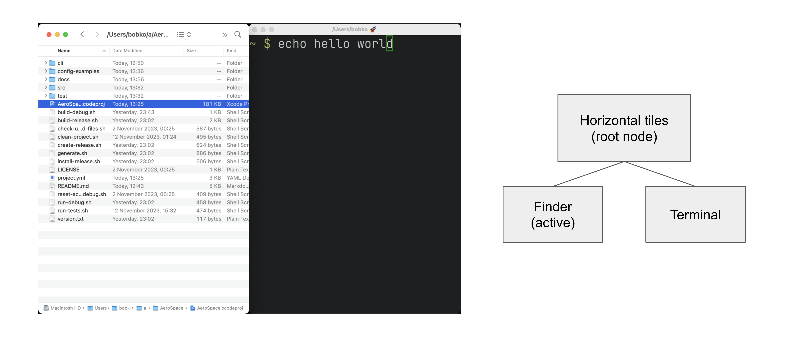
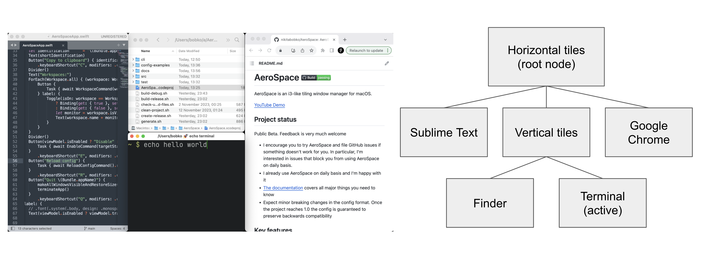
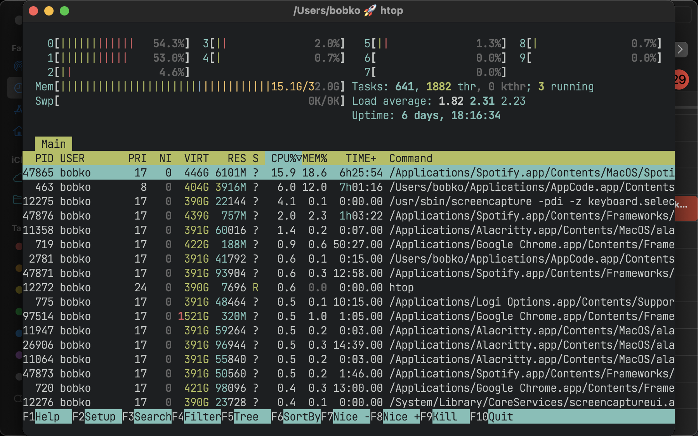
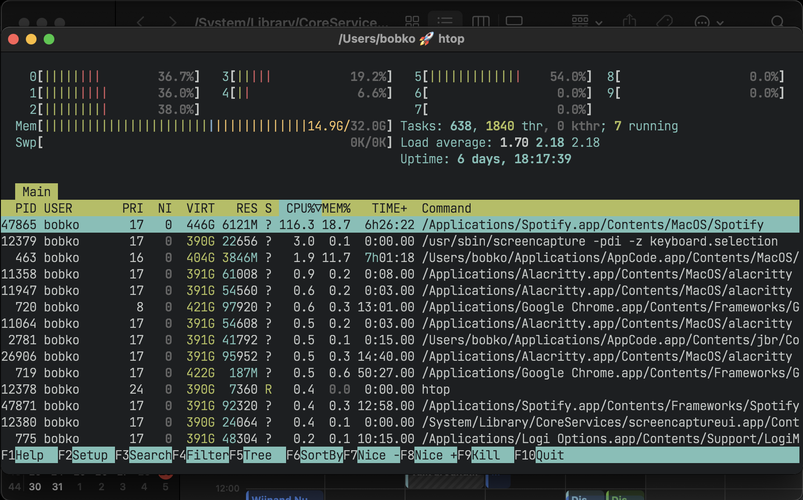
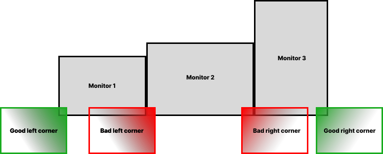
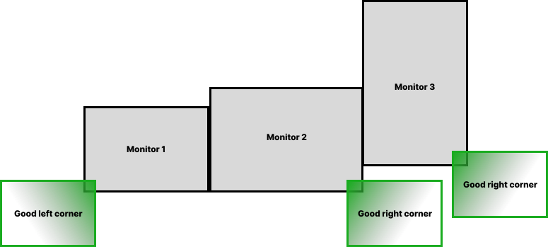
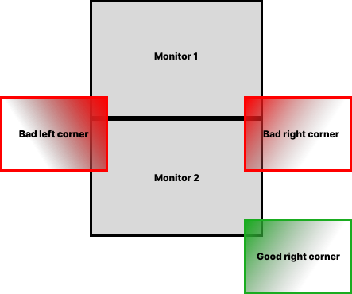
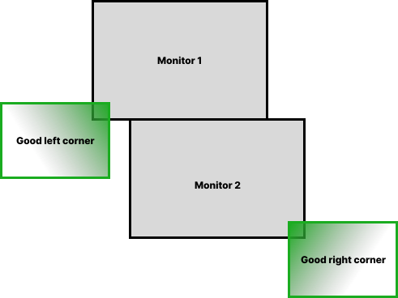

= AeroSpace Guide
include::util/site-attributes.adoc[]
:url-search-for-config: https://github.com/search?q=path%3A*aerospace.toml&type=code

include::util/header.adoc[]

This Guide is designed to be read from top to bottom as a whole.
You can skip parts that are obvious.

[#installation]
== Installation

[#homebrew-installation]
=== Homebrew installation (Preferred)

https://brew.sh/[Homebrew] is a package manager for macOS

[source,bash]
----
brew install --cask nikitabobko/tap/aerospace
----

*(Optional)* You might need to configure your shell to enable completion provided by homebrew packages: https://docs.brew.sh/Shell-Completion
AeroSpace provides bash, fish and zsh completions.

You can also install specific previous https://github.com/nikitabobko/homebrew-tap/tree/main/Casks[pinned homebrew Casks versions]:
[source,bash]
----
brew install --cask nikitabobko/tap/aerospace@0.12.0
----

[#manual-installation]
=== Manual installation

. Download the latest available zip from https://github.com/nikitabobko/AeroSpace/releases[releases page]
. Unpack zip
. Put unpacked `AeroSpace-v$VERSION/AeroSpace.app` to `/Applications`
. Put unpacked `AeroSpace-v$VERSION/bin/aerospace` anywhere to `$PATH`
(The step is optional. It is only needed if you want to be able to interact with AeroSpace from CLI)

If you see this message

----
"AeroSpace.app" can't be opened because Apple cannot check it for malicious software.
----

**Option 1** to resolve the problem

```
xattr -d com.apple.quarantine /Applications/AeroSpace.app
```

**Option 2** to resolve the problem

. navigate in Finder to `/Applications/AeroSpace.app`
. Right mouse click
. Open (yes, it's that stupid)

[#configuring-aerospace]
== Configuring AeroSpace

[#config-location]
=== Custom config location

AeroSpace tries to find the custom config in two locations:

. `~/.aerospace.toml`
. `+${XDG_CONFIG_HOME}/aerospace/aerospace.toml+`
(environment variable `XDG_CONFIG_HOME` fallbacks to `~/.config` if the variable is not presented)

If the config is found in more than one location then the ambiguity is reported.

=== Config samples

Please see the following config samples:

* <<default-config,The default config>>
* xref:./goodies.adoc#i3-like-config[i3 like config]
* {url-search-for-config}[Search for configs by other users on GitHub] for inspiration

AeroSpace uses TOML 1.1.0 format for the config.
See https://toml.io/en/v1.1.0[TOML spec for more info]

[#default-config]
=== Default config

The default config is part of the documentation, it contains all trivial configuration keys with comments.
Please read the default config!
Non-trivial configuration options are mentioned further in this guide.
If no custom config is found, AeroSpace will load the default config.

If the key is omitted in the custom config, it falls back to the value in the default config, unless it's stated otherwise for the specific keys. Namely:

* `mode.*.binding`. It falls back to the empty TOML table. Your config is the source of truth for keyboard bindings. You must explicitly mention all the keyboard bindings and <<binding-modes,binding modes>> in your config.
* `on-focused-monitor-changed`. It falls back to the empty TOML array.
* `exec` TOML table. See: <<exec-env-vars>> (It's so boring and verbose, I don't even want to mention it in the `default-config.toml`)

Rule of thumb: all the "scalar like" values always fall back to the default config. All the "vector like" values fall back to the empty TOML array or table.

That allows you to keep your config tidy and clean from trivial config keys for which you like the default values.
You can bootstrap your custom config by copying the default config from the app installation:

[source,shell]
----
cp /Applications/AeroSpace.app/Contents/Resources/default-config.toml ~/.aerospace.toml
----

link:config-examples/default-config.toml[Download default-config.toml]

[source,toml,subs="macros+,specialchars+"]
----
include::config-examples/default-config.toml[]
----

[#binding-modes]
=== Binding modes

You can create multiple sets of bindings by creating different binding modes.
When you switch to a different binding mode, all the bindings from the current mode are deactivated, and only the bindings specified in the new mode become active.
The initial binding mode that AeroSpace starts out with is "main".

This feature is absolutely identical to the one
https://i3wm.org/docs/userguide.html#binding_modes[in i3]

Working with binding modes consists of two parts:
1. defining a binding to switch to the binding mode and 2. declaring the binding mode itself.

[source,toml]
----
[mode.main.binding]            # Declare 'main' binding mode
    alt-r = 'mode resize'      # 1. Define a binding to switch to 'resize' mode

[mode.resize.binding]          # 2. Declare 'resize' binding mode
    minus = 'resize smart -50'
    equal = 'resize smart +50'
----

[#commands]
=== Commands

Commands are the thing you use to manipulate AeroSpace and query its state.

There are two ways on how you can use commands:

. Bind keys to run AeroSpace commands. Example:
+
[source,toml]
----
[mode.main.binding]
    # Bind alt-1 key to switch to workspace 1
    alt-1 = 'workspace 1'
    # Or bind a sequence of commands
    alt-shift-1 = 'move-node-to-workspace 1; workspace 1'
----
. Run commands in CLI. Open up a Terminal.app and type:
+
[source,bash]
----
aerospace workspace 1
----

For the list of available commands see: xref:commands.adoc[]

[#shell]
=== Shell

AeroSpace reimplements a small subset of Shell syntax.
Namely, the well-known operators: `;`, `||`, `&&`, `|`, and parenthesis to specify the precedence (listed in the precedence order).

That is what allows you to combine commands and run them in sequence or pipe one into another:

[source,toml]
----
[mode.main.binding]
    alt-shift-1 = 'move-node-to-workspace 1; workspace 1'

    alt-right = 'list-workspaces --monitor focused --empty no | workspace --stdin next'
----

This Shell-like string is exactly what you pass to the xref:./commands.adoc#eval[eval command] argument.

[NOTE]
====
*(1)* In traditional Shell, `||` and `&&` have the same precedence and are left associative,
so `foo || bar && baz` parses as `(foo || bar) && baz`.
AeroSpace's shell syntax diverges from that dubious design decision.

Instead, it follows the hopefully more intuitive precedence rules, where `&&` operator has bigger binding power,
so the very same command above parses as `foo || (bar && baz)`.

*(2)* In AeroSpace, the pipe operator `|` semantic matches `set -o pipefail` from traditional shells.
====

[#key-mapping]
=== Keyboard layouts and key mapping

By default, key bindings in the config are perceived as `qwerty` layout.

If you use different layout, different alphabet, or you just want to have a fancy alias for the existing key, you can use `key-mapping.key-notation-to-key-code`.

[source,toml]
----
# Define my fancy unicorn key notation
key-mapping.key-notation-to-key-code = {
    unicorn = 'u',
}

[mode.main.binding]
    alt-unicorn = 'workspace wonderland' # (⁀ᗢ⁀)
----

* For `dvorak` and `colemak` users, AeroSpace offers preconfigured presets.
+
[source,toml]
----
key-mapping.preset = 'dvorak'  # or 'colemak'
----

[#config-version]
=== config-version

`config-version` is a mechanism for introducing breaking changes to AeroSpace.

Omitting `config-version` is equivalent to `config-version = 1` (the lowest possible version).
The currently highest possible version is 2.
It is recommended to use that version.

If `config-version` is lower than the highest possible, xref:./commands.adoc#reload-config[reload-config] will emit a warning to stderr.

[#config-version-2]
==== config-version = 2

By specifying `config-version = 2`, you opt-in to the following behavior:

* You unlock the possibility to specify `persistent-workspaces` config option in your config explicitly.
* The fallback value of `persistent-workspaces` becomes an empty array
(In `config-version = 1`, the fallback value of `persistent-workspaces` was inferred from the right hand side of your keyboard bindings. It's proved to be error-prone)

[#after-startup-command]
=== after-startup-command

You use `after-startup-command` to run arbitrary commands on AeroSpace startup.

Common use cases:

. Run third-party tool on AeroSpace startup (e.g. Sketchybar)
. Set default layouts for specific workspaces
+
[source,toml]
----
after-startup-command = [
    'layout --workspace 2 --root v_tiles',
    'layout --workspace 3 --root h_accordion',
]
----

[#exec-env-vars]
=== exec-* Environment Variables

You can configure environment variables of `exec-*` commands and callbacks (such as xref:commands.adoc#exec-and-forget[exec-and-forget], <<exec-on-workspace-change-callback>>)

* `exec.inherit-env-vars = true` configures whether inherit environment variables of `AeroSpace.app` or not. (The default is `true`)
* You can override env variables with the following syntax:
+
[source,toml]
----
[exec.env-vars]
    PATH = '${HOME}/bin:${PATH}'
----
+
Environment variable substitution is supported in form of `+${ENV_VAR}+`
* You can inspect what is the end result of environment variables using xref:commands.adoc#list-exec-env-vars[`list-exec-env-vars` command]
* GUI apps on macOS don’t have Homebrew’s prefix in their `PATH` by default (https://docs.brew.sh/FAQ#my-mac-apps-dont-find-homebrew-utilities[docs.brew.sh]).
That's why unless you override `exec` section in your config, AeroSpace falls back to the following `exec` configuration:
+
[source,toml]
----
[exec]
    inherit-env-vars = true
[exec.env-vars]
    PATH = '/opt/homebrew/bin:/opt/homebrew/sbin:${PATH}'
----

[#tree]
== Tree

AeroSpace stores all windows and containers in a tree.
AeroSpace tree tiling model is https://i3wm.org/docs/userguide.html#tree[inspired by i3].

*Definition.* Each non-leaf node is called a "Container"

WARNING: i3 has a different terminology.
"container" in i3 is the same as "node" in AeroSpace.

* Each workspace contains its own single root node
* Each container can contain arbitrary number of children nodes
* Windows are the only possible leaf nodes. Windows contain zero children nodes
* Every container has two properties:
. <<layouts,Layout>> (Possible values: `tiles`, `accordion`)
. Orientation (Possible values: `horizontal`, `vertical`)

When we say "layout of the window", we refer to the layout of the window’s parent container.

It’s easier to understand tree tiling model by looking at examples

.Simple tree structure. Two windows side-by-side


.Complex tree structure


You can nest containers as deeply as you want to.

You can navigate in the tree in 4 possible cardinal directions (left, down, up, right).
You use xref:commands.adoc#focus[focus command] to do that.

The tree structure can be changed with three commands:

. xref:commands.adoc#move[move]
. xref:commands.adoc#join-with[join-with]
. xref:commands.adoc#split[split] (it's for compatibility with i3. Please prefer `join-with` over `split`)

[#layouts]
=== Layouts

In total, AeroSpace provides 4 possible layouts:

- `h_tiles` horizontal tiles (in i3, it’s called "horizontal split")
- `v_tiles` vertical tiles (in i3, it’s called "vertical split")
- `h_accordion` horizontal accordion (analog of i3’s "tabbed layout")
- `v_accordion` vertical accordion (analog of i3’s "stacked layout")

<<tree,From the previous section>>, you’re already familiar with the `tiles` layout.

Accordion is a layout where windows are placed on top of each other.

* *The horizontal accordion* shows left and right paddings to visually indicate the presence of other windows in those directions.
* *The vertical accordion* shows top and bottom paddings to visually indicate the presence of other windows in those directions.

.Horizontal accordion


.Vertical accordion


Just like in a `tiles` layout, you can use the xref:commands.adoc#focus[focus] command to navigate an accordion layout.

You can navigate the windows in an `h_accordion` by using the `focus (left|right)` command.
While in a `v_accordion`, you can navigate the windows using the `focus (up|down)` command.

Accordion padding is configurable via `accordion-padding` option.

[#normalization]
=== Normalization

By default, AeroSpace does two types of tree normalizations:

. Containers that have only one child are "flattened".
The root container is an exception, it is allowed to have a single window child.
Configured by `enable-normalization-flatten-containers`
. Containers that nest into each other must have opposite orientations.
Configured by `enable-normalization-opposite-orientation-for-nested-containers`

[.lead]
*Example 1*

According to the first normalization, such layout isn’t possible:

----
h_tiles (root node)
└── v_tiles
    └── window 1
----

it will be immediately transformed into

----
v_tiles (new root node)
└── window 1
----

[.lead]
*Example 2*

According to the second normalization, such layout isn’t possible:

----
h_tiles
├── window 1
└── h_tiles
    ├── window 2
    └── window 3
----

it will be immediately transformed into

----
h_tiles
├── window 1
└── v_tiles
    ├── window 2
    └── window 3
----

Normalizations make it easier to understand the tree structure by looking at how windows are placed on the screen.
Though you can disable normalizations by placing these lines to your config:

[source,toml]
----
enable-normalization-flatten-containers = false
enable-normalization-opposite-orientation-for-nested-containers = false
----

Unless you're hardcore i3 user who knows what they are doing, it's recommended to keep the normalizations enabled.

[#floating-windows]
=== Floating windows

Normally, floating windows are not considered to be part of the <<tree,tiling tree>>.
But it’s not the case with xref:commands.adoc#focus[focus] command.

From xref:commands.adoc#focus[focus] command perspective, floating windows are part of <<tree,tiling tree>>.
The floating window parent container is determined as the smallest tiling container that contains the center of the floating window.

This technique eliminates the need for an additional binding for focusing floating windows.

[#emulation-of-virtual-workspaces]
== Emulation of virtual workspaces

Native macOS Spaces have a lot of problems

* The animation for Spaces switching is slow
** You can’t disable animation for Spaces switching (you can only make it slightly faster by turning on `Reduce motion` setting, but it’s suboptimal)
* You have a limit of Spaces (up to 16 Spaces with one monitor)
* You can’t create/delete/reorder Space and move windows between Spaces with hotkeys (you can only switch between Spaces with hotkeys)
* Apple doesn't provide public API to communicate with Spaces (create/delete/reorder/switch Space and move windows between Spaces)

Since Spaces are so hard to deal with, AeroSpace reimplements Spaces and calls them "Workspaces".
The idea is that if the workspace isn’t active then all of its windows are placed outside the visible area of the screen, in the bottom right or left corner.
Once you switch back to the workspace, (e.g. by the means of xref:commands.adoc#workspace[workspace] command, or `cmd + tab`) windows are placed back to the visible area of the screen.

When you quit the AeroSpace or when the AeroSpace detects that it's about to crash, AeroSpace will place all windows back to the visible area of the screen.

AeroSpace shows the name of currently active workspace in its tray icon (top right corner), to give users a visual feedback on what workspace is currently active.

The intended workflow of using AeroSpace workspaces is to only have one macOS Space (or as many monitors you have, if `Displays have separate Spaces` is enabled) and don’t interact with macOS Spaces anymore.

[NOTE]
====
For better or worse, macOS doesn’t allow to place windows outside the visible area entirely.
You will still be able to see a 1 pixel vertical line of "hidden" windows in the bottom right or left corner of your screen.
That means, that if AeroSpace crashes badly you will still be able to manually "unhide" the windows by dragging these few pixels to the center of the screen.

If you want to minimize the visibility of hidden windows, it's recommended to place Dock in the bottom (and additionally turn automatic hiding on)
====

=== Proper monitor arrangement

Since AeroSpace needs a free space to hide windows in,
please make sure to arrange monitors in a way where *every monitor has free space in the bottom right or left corner.* (`System Settings -> Displays -> Arrange...`)

If you fail to arrange your monitors properly, you will see parts of hidden windows on other monitors.

.Bad monitor arrangement. Monitor 2 doesn't have free space in either of the bottom corners


.Good monitor arrangement. Every monitor has free space in either of the bottom corners


.Bad monitor arrangement. Monitor 1 doesn't have free space in either of the bottom corners


.Good monitor arrangement. Every monitor has free space in either of the bottom corners


[#a-note-on-mission-control]
=== A note on mission control

For some reason, mission control doesn't like that AeroSpace puts a lot of windows in the bottom right corner of the screen.
Mission control shows windows too small even when there is enough space to show them bigger.

There is a workaround. You can enable `Group windows by application` setting:
[source,bash]
----
defaults write com.apple.dock expose-group-apps -bool true && killall Dock
----
(or in System Settings: `System Settings -> Desktop & Dock -> Group windows by application`). For whatever weird reason, it helps.

[#a-note-on-displays-have-separate-spaces]
=== A note on '`Displays have separate Spaces`'

There is an observation that macOS works better and more stable if you disable `Displays have separate Spaces`. (It's enabled by default)
People report all sorts of weird issues related to focus and performance when this setting is enabled:

* Wrong window may receive focus in multi-monitor setup: https://github.com/nikitabobko/AeroSpace/issues/101[#101] (Bug in Apple API)
* Wrong borderless Alacritty window may receive focus in *single monitor* setup: https://github.com/nikitabobko/AeroSpace/issues/247[#247] (Bug in Apple API)
* Performance issues: https://github.com/nikitabobko/AeroSpace/issues/333[#333]
* macOS randomly switches focus back: https://github.com/nikitabobko/AeroSpace/issues/289[#289]

When `Displays have separate Spaces` is enabled,
moving windows between monitors causes windows to move between different Spaces which is not correctly handled by the public APIs AeroSpace uses,
apparently, these APIs are not aware about Spaces existence.
Spaces are just cursed in macOS. The less Spaces you have, the better macOS behaves.

|===
|    |'`Displays have separate Spaces`' is enabled |'`Displays have separate Spaces`' is disabled

|Is it possible for window to span across several monitors?
|❌ No. macOS limitation
|👍 Yes

|Overall stability and performance
|❌ Weird focus and performance issues may happen (see the list above)
|👍 Public Apple API are more stable (which in turn affects AeroSpace stability)

|When the first monitor is in fullscreen
|👍 Second monitor operates independently
|❌ Second monitor is unusable black screen

|macOS status bar ...
|... is displayed on both monitors
|... is displayed only on main monitor
|===

If you don't care about macOS native fullscreen in multi-monitor setup (which is itself clunky anyway, since it creates a separate Space instance),
I recommend disabling `Displays have separate Spaces`.

You can disable the setting by running:
[source,bash]
----
defaults write com.apple.spaces spans-displays -bool true && killall SystemUIServer
----
(or in System Settings: `System Settings -> Desktop & Dock -> Displays have separate Spaces`). Logout is required for the setting to take effect.

== Callbacks

[#on-window-detected-callback]
=== 'on-window-detected' callback

You can use `on-window-detected` config option to run commands every time a new window is detected.

[source,toml]
----
on-window-detected = [
    {
        if = 'test %{app-bundle-id} = com.apple.systempreferences',
        check-further-callbacks = true,
        run = ['layout floating', 'move-node-to-workspace S'],  # The callback itself
    },
]
----

`on-window-detected` is an ordered list of callback objects.
Every object has `if` (optional) and `run` (mandatory) keys inside.
When a new window is detected:

. AeroSpace processes the list of the callback objects in the defined order.
. For every callback object, AeroSpace runs the command in the `if`.
. If the `if` command exits with zero exit code (successful), then AeroSpace runs the command in the `run` and doesn't process any further callback objects.
. If the `if` command exits with non-zero exit code (fail), then AeroSpace attempts processing the next object in the list.

xref:./commands.adoc#test[test], xref:./commands.adoc#test-not[test-not], xref:./commands.adoc#true[true] and xref:./commands.adoc#false[false] commands are designed to be used inside the `if`.

Additionally, if you want to keep processing the list of callbacks when the `if` is successful, you can use the `check-further-callbacks` option like so:

[source,toml]
----
on-window-detected = [
    {
        if = 'test %{app-bundle-id} = com.apple.systempreferences',
        run = ['layout floating', 'move-node-to-workspace S'],

        # The next callbacks will be considered even if this one is successful.
        check-further-callbacks = true,
    },
    # all other callbacks...
]
----

A common use case is to match against app bundle ID in `on-window-detected` callback.
There are several ways to know `app-bundle-id`:

* Take a look at precompiled xref:./goodies.adoc#popular-apps-ids[list of Apple application IDs]
* You can use xref:./commands.adoc#list-apps[`aerospace list-apps`] CLI command to get IDs of running applications
* `mdls -name kMDItemCFBundleIdentifier -r /Applications/App.app`

IMPORTANT: Some windows initialize their title after the window appears.
`window-title-regex-substring` may not work as expected for such windows

Examples of automations:

* Assign apps on particular workspaces
+
[source,toml]
----
on-window-detected = [
    {
        if = 'test %{app-bundle-id} = org.alacritty',
        run = 'move-node-to-workspace T', # mnemonics T - Terminal
    },
    {
        if = 'test %{app-bundle-id} = com.google.Chrome || test %{app-bundle-id} = org.mozilla.firefox',
        run = 'move-node-to-workspace W', # mnemonics W - Web browser
    },
    {
        if = 'test %{app-bundle-id} = com.jetbrains.intellij',
        run = 'move-node-to-workspace I', # mnemonics I - IDE
    }
]
----
* Make all windows float by default
+
[source,toml]
----
on-window-detected = [
    { check-further-callbacks = true, run = 'layout floating', },
    # all other callbacks...
]
----

[#on-focus-changed-callbacks]
=== 'on-focus-changed' callbacks

You can track focus changes using the following callbacks: `on-focus-changed` and `on-focused-monitor-changed`.

* `on-focus-changed` is called every time focused window or workspace changes.
* `on-focused-monitor-changed` is called every time focused monitor changes.

A common use case for the callbacks is to implement "mouse follows focus" behavior. All you need is to combine the callback of your choice with xref:commands.adoc#move-mouse[move-mouse command]:
[source,toml]
----
on-focused-monitor-changed = ['move-mouse monitor-lazy-center'] # Mouse lazily follows focused monitor (default in i3)
# or
on-focus-changed = ['move-mouse window-lazy-center'] # Mouse lazily follows any focus (window or workspace)
----

You shouldn't rely on the order callbacks are called, since it's an implementation detail and can change from version to version.

The callbacks are "recursion resistant", which means that any focus change within the callback won't retrigger the callback.
Changing the focus within these callbacks is a bad idea anyway, and the way it's handled will probably change in future versions.

[#exec-on-workspace-change-callback]
=== 'exec-on-workspace-change' callback

`exec-on-workspace-change` callback allows to run arbitrary process when focused workspace changes.
It may be useful for integrating with bars.

[source,toml]
----
# Notify Sketchybar about workspace change
exec-on-workspace-change = ['/bin/bash', '-c',
    'sketchybar --trigger aerospace_workspace_change FOCUSED=$AEROSPACE_FOCUSED_WORKSPACE'
]
----

Besides the <<exec-env-vars,`exec.env-vars`>>, the process has access to the following environment variables:

* `AEROSPACE_FOCUSED_WORKSPACE` - the workspace user switched to
* `AEROSPACE_PREV_WORKSPACE` - the workspace user switched from

For a more elaborate example on how to integrate with Sketchybar see
xref:./goodies.adoc#show-aerospace-workspaces-in-sketchybar[]

[#environment-variables]
== Environment variables

When AeroSpace runs a callback's command (such as the `test`/`run` clause of an <<on-window-detected-callback>>, or the command in an <<on-focus-changed-callbacks>>),
it adds one of the following environment variables to the command's environment to identify the target the callback fired against:

* `AEROSPACE_WINDOW_ID` - the numeric ID of a specific window
* `AEROSPACE_WORKSPACE` - the name of a specific workspace

If there is a target window, `AEROSPACE_WINDOW_ID` is set to its ID.
Otherwise (the target is an empty workspace with no window to point at), `AEROSPACE_WORKSPACE` is set to that workspace's name instead.
Exactly one of the two is set at a time.

In practice:

* For <<on-window-detected-callback>>, the target is the newly detected window, so `AEROSPACE_WINDOW_ID` is always set.
* For <<on-focus-changed-callbacks>> (`on-focus-changed`, `on-focused-monitor-changed`), the target is the new focus, so `AEROSPACE_WINDOW_ID` is set when a window is focused, and `AEROSPACE_WORKSPACE` is set when focus lands on an empty workspace.

Commands that need a target (xref:commands.adoc#layout[layout], xref:commands.adoc#move-node-to-workspace[move-node-to-workspace], xref:commands.adoc#move[move], etc.)
honor the forwarded context before falling back to the currently focused window or workspace.
That makes all commands in callbacks operate on the originating window or workspace even when global focus has already moved:

[source,toml]
----
on-window-detected = [
    # Both commands operate on the *just-detected* window:
    #   1. 'move-node-to-workspace 2' moves the new window to workspace 2.
    #      Moving the window away typically causes some *other* window on
    #      the current workspace to receive focus.
    #   2. 'layout floating' still floats the originally detected window
    #      (not the window that became focused after step 1), because the second
    #      command inherits the same AEROSPACE_WINDOW_ID as the first.
    { if = 'true', run = 'move-node-to-workspace 2; layout floating' },

    # 'aerospace move-node-to-workspace W' moves the *newly detected* window,
    # because the child shell inherits AEROSPACE_WINDOW_ID pointing at it.
    { if = 'true', run = 'exec-and-forget sleep 1; aerospace move-node-to-workspace W' },
]
----

[#overriding-context]
=== Overriding the context with `--window-id` / `--workspace`

Many commands that need a target (xref:commands.adoc#layout[layout], xref:commands.adoc#move-node-to-workspace[move-node-to-workspace], xref:commands.adoc#close[close], etc.) accept explicit `--window-id <id>` and/or `--workspace <name>` options.
These flags take precedence over the environment variables.
The full resolution order, from highest to lowest priority, is:

. `--window-id` command-line option
. `--workspace` command-line option
. `AEROSPACE_WINDOW_ID` environment variable
. `AEROSPACE_WORKSPACE` environment variable
. The currently focused window or the currently focused empty workspace

[#multiple-monitors]
== Multiple monitors

* The pool of workspaces is shared between monitors
* Each monitor shows its own workspace.
The showed workspaces are called "visible" workspaces
* Different monitors can’t show the same workspace at the same time
* Each workspace (even invisible, even empty) has a monitor assigned to it
* By default, all workspaces are assigned to the "main" monitor ("main" as in `System -> Displays -> Use as`)

When you switch to a workspace:

. AeroSpace takes the assigned monitor of the workspace and makes the workspace visible on the monitor
. AeroSpace focuses the workspace

You can move workspace to a different monitor with xref:commands.adoc#move-workspace-to-monitor[move-workspace-to-monitor] command.

The idea of making pool of workspaces shared is based on [#observation]*the observation* that most users have a limited set of workspaces on their secondary monitors.
Secondary monitors are frequently dedicated to specific tasks (browser, shell), or for monitoring various activities such as logs and dashboards.
Thus, using one workspace per secondary monitor and "the rest" on the main monitor often makes sense.

[NOTE]
====
The only difference between AeroSpace and i3 is switching to empty workspaces.
When you switch to an empty workspace, AeroSpace puts the workspace on an assigned monitor; i3 puts the workspace on currently active monitor.

* I find that AeroSpace model works better with <<observation,_the observation_>> listed above.
* AeroSpace model is more consistent (it works the same for empty workspaces and non-empty workspaces)
====

[#assign-workspaces-to-monitors]
=== Assign workspaces to monitors

You can use `workspace-to-monitor-force-assignment` syntax to assign
workspaces to always appear on particular monitors

[source,toml]
----
[workspace-to-monitor-force-assignment]
    1 = 1                            # Monitor sequence number from left to right. 1-based indexing
    2 = 'main'                       # Main monitor
    3 = 'secondary'                  # Non-main monitor in case when there are only two monitors
    4 = 'built-in'                   # Case insensitive regex substring
    5 = '^built-in retina display$'  # Case insensitive regex match
    6 = ['secondary', 'dell']        # You can specify multiple patterns.
                                     #   The first matching pattern will be used
----

* Left hand side of the assignment is the workspace name
* Right hand side of the assignment is the monitor pattern

Supported monitor patterns:

* `main` - "Main" monitor ("main" as in `System Settings -> Displays -> Use as`)
* `secondary` - Non-main monitor in case when there are only two monitors
* `<number>` (e.g. `1`, `2`) - Sequence number of the monitor from left to right. 1-based indexing
* `<regex-pattern>` (e.g. `+dell.*+`, `+built-in.*+`) - Case insensitive regex substring pattern

You can specify multiple patterns as an array.
The first matching pattern will be used

xref:commands.adoc#move-workspace-to-monitor[move-workspace-to-monitor] command has no effect for workspaces that have monitor assignment

== Dialog heuristics

* Apple provides accessibility API for apps to let others know which of their windows are dialogs
* A lot of apps don't implement this API or implement it improperly
+
Even some Apple dialogs don't implement the API properly.
(E.g. Finder "Copy" progress window doesn't let others know that it's a dialog)

AeroSpace uses the API to gently ask windows whether they are dialogs, but AeroSpace also applies some heuristics.

For example, windows without a fullscreen button (NB! fullscreen button and maximize button are different buttons) are generally considered dialogs, excluding terminal apps (WezTerm, Alacritty, iTerm2, etc.).

Windows that are recognized as dialogs are floated by default.

If you find that some windows are not handled properly, you're welcome to create a PR that improves the heuristic.
It's fine to hardcode special handling for popular applications, AeroSpace already does it.
Please see `isDialogHeuristic` function in AeroSpace sources.

You can also use `on-window-detected` to force tile or force float all windows of a particular application:

. Force tile all the windows (or windows of a particular app)
+
[source,toml]
----
on-window-detected = [
    # Other callbacks...
    { if.app-id = '...', run = 'layout tiling', },
    # Other callbacks...
]
----
. Force float all the windows (or windows of a particular app)
+
[source,toml]
----
on-window-detected = [
    # Other callbacks...
    { if.app-id = '...', run = 'layout floating', },
    # Other callbacks...
]
----

== Common pitfall: keyboard keys handling

If you can't make AeroSpace handle some keys in your config, please make sure that you don't have keys conflict with other software that might listen to global keys (e.g. skhd, Karabiner-Elements, Raycast)

[#socket-protocol]
== Socket protocol

This section documents the client-server socket protocol that the `aerospace` CLI uses to talk to the running `AeroSpace.app` server.
It is intended for people who want to integrate with AeroSpace from a custom client (e.g. a status bar, an editor plugin, a script in a language without an `aerospace` wrapper).

[#socket-location]
=== Socket location

AeroSpace listens on a Unix-domain stream socket:

[source]
----
/tmp/bobko.aerospace-${USER}.sock        # AeroSpace.app (release builds)
/tmp/bobko.aerospace.debug-${USER}.sock  # AeroSpace-Debug.app (debug builds only)
----

`${USER}` is the result of `NSUserName()` in Swift (typically equivalent to `$USER` / `id -un` / `whoami` in shell).

[#socket-wire-format]
=== Wire format

All numbers on the wire are 4-byte unsigned integers in host byte order.
AeroSpace only runs on Apple Silicon and Intel macOS, both little-endian, so in practice the framing is always 4 bytes, little-endian.

Immediately after connecting, both sides perform a *one-shot handshake*:

. *The Client* writes its `SOCKET_PROTOCOL_VERSION` as a single 4-byte unsigned integer.
. *The Server* reads the client's `SOCKET_PROTOCOL_VERSION` and decides in what kind of compatibility mode it needs to communicate with this particular client.
. *The Server* writes its `SOCKET_PROTOCOL_VERSION` as a single 4-byte unsigned integer.
. *The Client* compares the two versions and decides if it wants to process.
. *The Server* compares the two versions and decides if it wants to process.

The current and the only valid value for `SOCKET_PROTOCOL_VERSION` is `1`.
Currently, right after sending its own version, the server disconnects if it doesn't recognise `SOCKET_PROTOCOL_VERSION`.

*After the handshake*, every message (in either direction) is a length-prefixed JSON frame:

[source]
----
+-----------------------+----------------------------+
| length (UInt32, LE)   | JSON payload (UTF-8 bytes) |
+-----------------------+----------------------------+
----

`length` is the byte length of the JSON payload, *not* counting the 4 length-prefix bytes themselves. The payload is a UTF-8-encoded JSON object.

The flow then depends on the command:

* *One-shot commands:* (basically, almost all commands) The client sends one `ClientRequest` frame.
  The server sends one `ServerAnswer` frame.
  This loop repeats indefinitely until the client disconnects.

* xref:./commands.adoc#subscribe[*subscribe command:*] (treated separately) The client sends one `ClientRequest` frame,
  then the server sends an unbounded stream of `ServerEvent` frames until the client disconnects.
  The client must not send anything else on the connection.

[#socket-client-request]
=== ClientRequest

The request payload is a JSON object with the following fields:

[source,json]
----
{
    "args": ["workspace", "1"],
    "stdin": "",
    "windowId": null,
    "workspace": null
}
----

[cols="1,1,3"]
|===
| Field | Type | Description

| `args`
| array of strings
| The CLI arguments as you would pass them to `aerospace`, *excluding* the program name itself.
For example, `["workspace", "1"]` is the wire form of `aerospace workspace 1`.
To send the `subscribe` command, pass `["subscribe", ...]` here.

| `stdin`
| string
| Contents to feed to the command as standard input.
Use `""` if the command doesn't read stdin.
Some commands (e.g. xref:./commands.adoc#workspace[`workspace --stdin`]) consume this field.

| `windowId`
| unsigned 32-bit integer or `null`
| The value of the `AEROSPACE_WINDOW_ID` environment variable as the client saw it, or `null` if there is no such variable in scope.
AeroSpace sets this variable when invoking callbacks so that the called commands know the window they was triggered from (see <<environment-variables>>).

| `workspace`
| string or `null`
| The value of the `AEROSPACE_WORKSPACE` environment variable as the client saw it, or `null` if unset. Same rationale as `windowId`.
|===

[#socket-server-answer]
=== ServerAnswer

The reply to a one-shot command is a JSON object:

[source,json]
----
{
    "exitCode": 0,
    "stdout": "1\n2\n3",
    "stderr": "",
    "serverVersionAndHash": "0.20.0-Beta 33fa0643"
}
----

[cols="1,1,3"]
|===
| Field | Type | Description

| `exitCode`
| signed 32-bit integer
| `0` on success, non-zero on failure. Mirrors what the `aerospace` CLI would have exited with.

| `stdout`
| string
| What the CLI would have printed to standard output. May contain newlines.

| `stderr`
| string
| What the CLI would have printed to standard error.

| `serverVersionAndHash`
| string
| Free-form `"<version> <git-hash>"` identifying the running server. Useful for compatibility checks; compare against the equivalent string from your own client and warn the user on mismatch.
|===

[#socket-subscribe]
=== Subscribe mode

When the client sends a request with `args` starting with `"subscribe"`, the server enters event-streaming mode. The remaining `args` follow the same syntax as the xref:./commands.adoc#subscribe[`aerospace subscribe`] CLI command (`--all`, `--no-send-initial`, or an explicit list of event types).

After accepting the subscription, the server writes framed JSON objects in the same length-prefixed format as `ServerAnswer`. The server keeps writing until the connection is closed.

[#socket-example]
=== End-to-end example

A minimal Python client that runs `aerospace list-workspaces --focused`:

[source,python]
----
import getpass, json, socket, struct

SOCKET_PROTOCOL_VERSION = 1
sock_path = f"/tmp/bobko.aerospace-{getpass.getuser()}.sock"

def send_frame(s, payload):
    s.sendall(struct.pack("<I", len(payload)) + payload)

def recv_exact(s, n):
    buf = b""
    while len(buf) < n:
        chunk = s.recv(n - len(buf))
        if not chunk:
            raise ConnectionError("server closed connection")
        buf += chunk
    return buf

def recv_frame(s):
    (length,) = struct.unpack("<I", recv_exact(s, 4))
    return recv_exact(s, length)

with socket.socket(socket.AF_UNIX, socket.SOCK_STREAM) as s:
    s.connect(sock_path)

    # Version handshake
    s.sendall(struct.pack("<I", SOCKET_PROTOCOL_VERSION))
    (server_version,) = struct.unpack("<I", recv_exact(s, 4))
    if server_version != SOCKET_PROTOCOL_VERSION:
        raise RuntimeError(f"unsupported server version {server_version}")

    # One-shot command
    request = {
        "args": ["list-workspaces", "--focused"],
        "stdin": "",
        "windowId": None,
        "workspace": None,
    }
    send_frame(s, json.dumps(request).encode("utf-8"))

    answer = json.loads(recv_frame(s))
    if answer["exitCode"] != 0:
        raise RuntimeError(answer["stderr"])
    print(answer["stdout"])
----

== Deprecations

=== Legacy 'on-window-detected' syntax

The following `if.*` syntax inside `on-window-detected` is soft deprecated.
It is still supported, and it will probably remain supported forever given its wide use.

[source,toml]
----
on-window-detected = [
    {
        if.app-id = 'com.apple.systempreferences', # ❌ Please don't do that
        run = ['layout floating', 'move-node-to-workspace S'],
    },
]
----

Instead of the `if.*` syntax, you are encouraged to use `if = 'test ...'` syntax.
See xref:./commands.adoc#test[the test helper command documentation] for more information.

[source,toml]
----
on-window-detected = [
    {
        if = 'test %{app-bundle-id} = com.apple.systempreferences', # ✅ Do this
        run = ['layout floating', 'move-node-to-workspace S'],
    },
]
----
