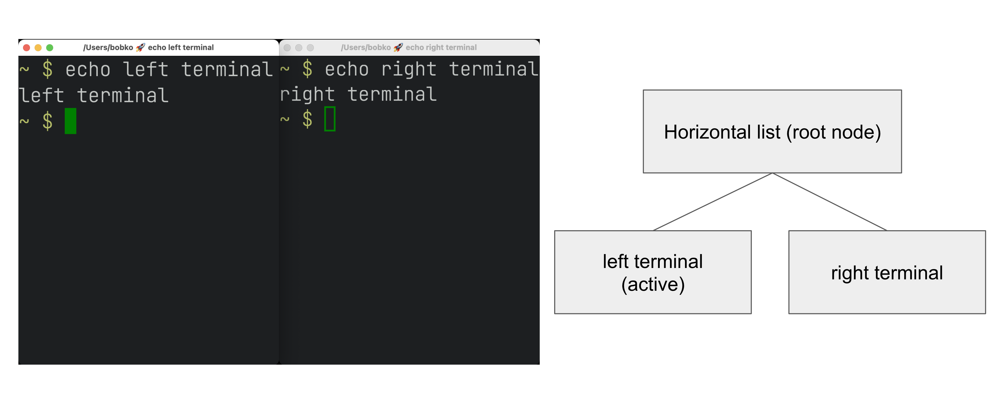
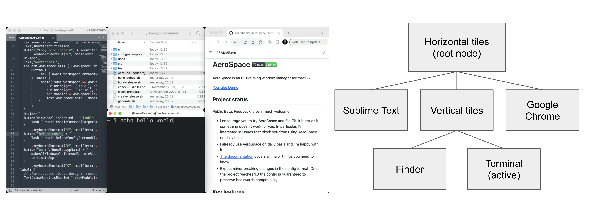

# AeroSpace Guide

**Table of contents**

- [Configuring AeroSpace](#configuring-aerospace)
  - [Binding modes](#bindings-modes)
  - [Commands](#commands)
- [Tree](#tree)
  - [Layouts](#layouts)
  - [Normalization](#normalization)
  - [Floating windows](#floating-windows)
- [Emulation of virtual workspaces](#emulation-of-virtual-workspaces)
  - [A note on mission control](#a-note-on-mission-control)
  - [A note on 'Displays have separate Spaces'](#a-note-on-displays-have-separate-spaces)
- [Multiple displays](#multiple-displays)

## Configuring AeroSpace

AeroSpace will read config file from `~/.aerospace.toml`. Please see the following config samples:
- The default config contains all possible keys with comments: [default-config.toml](../config-examples/default-config.toml)
- i3 like config: [i3-like-config-example.toml](../config-examples/i3-like-config-example.toml)

AeroSpace uses TOML format for the config. TOML is easy to read, and it supports comments. See [TOML site for more
info](https://toml.io/en/)

### Binding modes

You can create multiple sets of bindings by creating different binding modes. When you switch to a different binding mode, all
the bindings from the current mode are deactivated, and only the bindings specified in the new mode become active. The initial
binding mode that AeroSpace starts out with is "main".

This feature is absolutely identical to the one [in i3](https://i3wm.org/docs/userguide.html#binding_modes)

Working with binding modes consists of two parts: 1. defining a binding to switch to the binding mode and 2. declaring the binding
mode itself.

```toml
[mode.main.binding] # Declare 'main' binding mode
alt-r = 'mode resize' # 1. Define a binding to switch to 'resize' mode

[mode.resize.binding] # 2. Declare 'resize' binding mode
minus = 'resize smart -50'
equal = 'resize smart +50'
```

### Commands

AeroSpace is controlled by commands. For more info see [the list of all available commands](./commands.md).

## Tree

AeroSpace stores all windows and containers in a tree. AeroSpace tree tiling model is [inspired by
i3](https://i3wm.org/docs/userguide.html#tree).

**Definition.** Each non-leaf node is called a "Container"

> [!WARNING]
> i3 has a different terminology. In i3, terms "container" and "node" are the same.

- Each workspace contains its own single root node
- Each container can contain arbitrary number of children nodes
- Windows are the only possible leaf nodes. Windows contain zero children nodes
- Every container has two properties:
  1. [Layout](#layouts) (Possible values: `list`, `accordion`)
  2. Orientation (Possible values: `horizontal`, `vertical`)

When we say "layout of the window", we refer to the layout of the window's parent container.

It's easier to understand tree tiling model by looking at examples




You can nest containers as deeply as you want to.

You can navigate in the tree in 4 possible cardinal directions (left, down, up, right). You use [focus
command](./commands.md#focus) to navigate in the tree.

The tree structure can be changed with two commands:
- [move-through](./commands.md#move-through)
- [join-with](./commands.md#join-with)

### Layouts

In total, AeroSpace provides 4 possible layouts:
- horizontal list (in i3, it's called "horizontal split")
- vertical list (in i3, it's called "vertical split")
- horizontal accordion (analog of i3's "tabbed layout")
- vertical accordion (analog of i3's "stacked layout")

From the previous section, you're already familiar with the List layout.

Accordion is a layout where windows are placed on top of each other.
- The horizontal accordion shows left and right paddings to visually indicate the presence of other windows in those directions.
- The vertical accordion shows top and bottom paddings to visually indicate the presence of other windows in those directions.

Horizontal accordion looks like this


Vertical accordion looks like this


Just like in a list layout, you can use the [focus](./commands.md#focus) command to navigate an accordion layout.

You can navigate the windows in an `h_accordion` by using the `focus (left|right)` command, while in a `v_accordion`, you can
navigate the windows using the `focus (up|down)` command.

Accordion padding is configurable via `accordion-padding` option (see [default-config.toml](../config-examples/default-config.toml))

### Normalization

By default, AeroSpace does two types of tree normalizations:
- Containers that have only one child are "flattened". Configured by `enable-normalization-flatten-containers`
- Containers that nest into each other must have opposite orientations. Configured by
  `enable-normalization-opposite-orientation-for-nested-containers`

**Example 1**

According to the first normalization, such layout isn't possible:
```
h_list
└── v_list
    └── window 1
```

it will be immediately transformed into
```
v_list
└── window 1
```

**Example 2**

According to the second normalization, such layout isn't possible:
```
h_list
├── window 1
└── h_list
    ├── window 2
    └── window 3
```

it will be immediately transformed into
```
h_list
├── window 1
└── v_list
    ├── window 2
    └── window 3
```

Normalizations makes it easier to understand the tree structure by looking at how windows are placed on the screen.

You can disable normalizations by placing these lines into your config:
```
enable-normalization-flatten-containers = false
enable-normalization-opposite-orientation-for-nested-containers = false
```

### Floating windows

Normally, floating windows are not considered to be part of the [tiling tree](#tree). But it's not the case with
[`focus`](./commands.md#focus) command.

From [`focus`](./commands.md#focus) command perspective, floating windows are part of [the tree](#tree). The floating window
parent container is determined as the smallest tiling container that contains the center of the floating window.

This technique eliminates the need for an additional binding for focusing floating windows.

## Emulation of virtual workspaces

Native macOS Spaces have a lot of problems.

- The animation for Spaces switching is slow
  - You can't disable animation for Spaces switching (you can only make it slightly faster by turning on `Reduce motion` setting,
    but it's suboptimal)
- You have a limit of Spaces (up to 16 Spaces with one monitor)
- You can't create/delete/reorder Space and move windows between Spaces with hotkeys (you can only switch between Spaces with
  hotkeys)
- Apple doesn't provide public API to communicate with Spaces (create/delete/reorder/switch Space and move windows between Spaces)

Since Spaces are so hard to deal with, AeroSpace reimplements Spaces and calls them "Workspaces". The idea is that if the
workspace isn't active then all of its windows are placed outside of the visible area of the screen, at the bottom right corner.
Once you switch back to the workspace, (e.g. by the means of [`workspace`](./commands.md#workspace) command) windows are placed
back to the visible area of the screen.

When you quit the AeroSpace or when the AeroSpace is about to crash, AeroSpace will place all windows back to the visible area of
the screen.

> [!NOTE]
> For better or worse, macOS doesn't allow to place windows outside of the visible area entirely. You will still be able to see a
> few pixels of "hidden" windows at the bottom right corner of your screen. That means, that if AeroSpace crashes badly you will
> still be able to manually "unhide" the windows by dragging these few pixels to the center of the screen.

The supposed workflow of using AeroSpace workspaces is to only have one macOS Space (or as many as monitors you have, if `Displays
have separate Spaces` is enabled) and don't interact with macOS Spaces anymore.

### A note on mission control

For some reason, mission control doesn't like that AeroSpace puts a lot of windows at the bottom right corner of the screen.
Mission control shows windows too small even if it has enough space to show them bigger.

To workaround it, you can enable `System Settings -> Desktop & Dock -> Group windows by application` setting. For some weird
reason, it helps.

### A note on 'Displays have separate Spaces'

AeroSpace doesn't care about `System Settings -> Desktop & Dock -> Displays have separate Spaces` setting. It works equally good
whether this option is enabled or disabled.

Overview of 'Displays have separate Spaces'

|                                                             | 'Displays have separate Spaces' is enabled | 'Displays have separate Spaces' is disabled |
|-------------------------------------------------------------|--------------------------------------------|---------------------------------------------|
| When the first display is in fullscreen                     | 😊 Second monitor operates independently   | 😔 Second monitor is unusable black screen  |
| Is it possible to place a window on the border of monitors? | 😔 No                                      | 😊 Yes                                      |
| macOS status bar ...                                        | ... is displayed on both monitors          | ... is displayed only on main monitor       |

## Multiple displays

- The pool of workspaces is shared between displays
- Each display shows its own workspace. The showed workspaces are called "active" workspaces
- Different displays can't show the same workspace at the same time
- Each workspace (even invisible, even empty) has a display assigned to it
- By default, all workspaces are assigned to the "main" display (You can find the "main" display in `System -> Displays`)

When you switch to a workspace:
1. AeroSpace takes the assigned display of the workspace and makes the workspace active on the display
2. AeroSpace focuses the workspace

You can move workspace to a different display with [`move-workspace-to-display`](./commands.md#move-workspace-to-display) command. 

The idea of making pool of workspaces shared is based on **the observation** that most users have a limited set of workspaces on
their secondary displays. Secondary displays are frequently dedicated to specific tasks (browser, shell), or for monitoring
various activities such as logs and dashboards. Thus, using one workspace per each secondary displays and "the rest" on the main
display often makes sense.

> [!NOTE]
> The only difference between AeroSpace and i3 is switching to empty workspaces. When you switch to an empty workspace, AeroSpace
> puts the workspace on an assigned display; i3 puts the workspace on currently active display.
> - I find that AeroSpace model works better with **the observation** listed above.
> - AeroSpace model is more consistent (it works the same for empty workspaces and non-empty workspaces)
